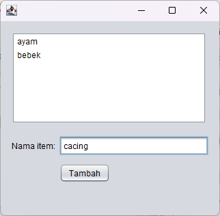
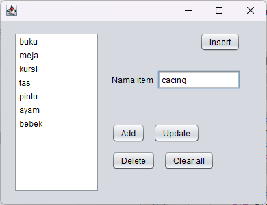
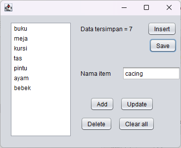
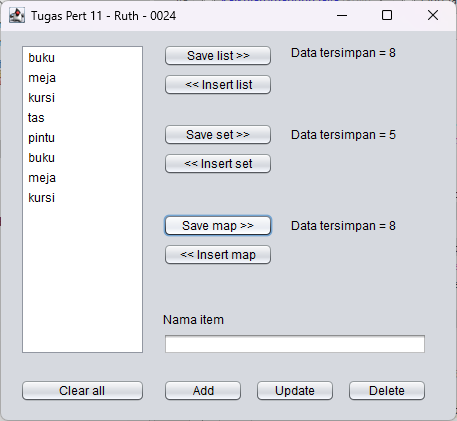

# Hasil Penugasan Simple GUI Pertemuan 11

## GUI Frame 01

    

## GUI Frame 02

    

## GUI Frame 03

    

## GUI Frame 04

    

Disini ada 3 jenis koleksi:

- List : array biasa

- Set : array tapi tidak bisa menyimpan elemen duplikat

- Map : array tapi ada key nya untuk tiap elemen